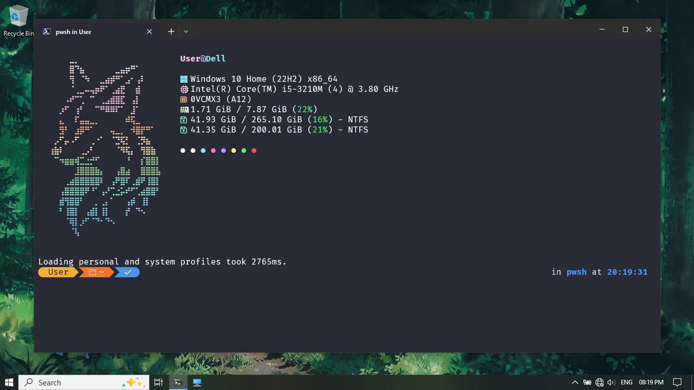

# PowerShell Configuration

A beautiful and customized PowerShell setup with Oh My Posh and FastFetch. Follow the instructions below to get the same look on your system.

## Prerequisites

Before you begin, please install the following:

### 1. PowerShell 7 (Recommended)

For better autocompletion and performance, install **PowerShell 7**:

```powershell
winget install Microsoft.PowerShell
```

> **Note**: PowerShell 7 provides superior autocompletion features. You can toggle between PowerShell 5 (built-in) and PowerShell 7 by simply launching the appropriate version, or set PowerShell 7 as your default terminal.

To check your PowerShell version:

```powershell
$PSVersionTable.PSVersion
```

### 2. Fira Code Nerd Font

First, download and install the **Fira Code Nerd Font**:

- Visit [Nerd Fonts - Fira Code](https://www.nerdfonts.com/font-downloads)
- Download **FiraCode.zip**
- Extract the files
- Select all `.ttf` files and right-click → **Install** (or Install for all users)
- Restart PowerShell to apply the font

> **Note**: The Fira Code Nerd Font is required for proper icon rendering in PowerShell.

### 2. Oh My Posh

Install Oh My Posh using this command in PowerShell:

```powershell
winget install JanDeDobbeleer.OhMyPosh --source winget
```

### 3. FastFetch

Install FastFetch using this command in PowerShell:

```powershell
winget install fastfetch
```

## Installation & Setup

Follow these steps to configure your PowerShell:

### Step 1: Clone or Download the Repository

Download this repository and extract it to a temporary location.

### Step 2: Copy .config Folder

1. Copy the **.config** folder from this repository
2. Navigate to: `C:\Users\<YourUsername>`
3. Paste the **.config** folder here

### Step 3: Copy PowerShell Profile

1. Copy the **PowerShell** folder from this repository
2. Navigate to: `C:\Users\<YourUsername>\Documents`
3. Paste the **PowerShell** folder here

### Step 4: Hide Folders (Optional but Recommended)

To hide both folders from normal view:

#### Hide .config Folder:

1. Navigate to `C:\Users\<YourUsername>`
2. Right-click on the **.config** folder
3. Select **Properties**
4. Check the **Hidden** checkbox under Attributes
5. Click **Apply** → **OK**

#### Hide PowerShell Folder:

1. Navigate to `C:\Users\<YourUsername>\Documents`
2. Right-click on the **PowerShell** folder
3. Select **Properties**
4. Check the **Hidden** checkbox under Attributes
5. Click **Apply** → **OK**

### Step 5: Configure PowerShell Font

1. Open **PowerShell**
2. Right-click on the title bar → **Properties** (or **Settings** in Windows Terminal)
3. Go to the **Font** tab
4. Select **Fira Code Nerd Font** from the dropdown
5. Click **OK**

### Step 6: Restart PowerShell

Close and reopen PowerShell to see the changes take effect.

## Final Result

Your PowerShell should now look like this:



## Customization

### Change ASCII Art Display

You can customize the ASCII art that displays in FastFetch by editing the **ascii.txt** file:

1. Navigate to: `C:\Users\<YourUsername>\.config`
2. Open the **ascii.txt** file with your preferred text editor (Notepad, VS Code, etc.)
3. Replace the ASCII art with your own custom design
4. Save the file
5. Restart PowerShell to see the changes

> **Tip**: You can find cool ASCII art online or create your own to personalize your terminal!

## Folder Structure

```
.config/                    → Configuration files (C:\Users\<YourUsername>)
PowerShell/                 → PowerShell profile (C:\Users\<YourUsername>\Documents)
├── Microsoft.PowerShell_profile.ps1
```

## Troubleshooting

### Icons not displaying correctly

- Make sure you installed **Fira Code Nerd Font** and set it as your PowerShell font
- Restart PowerShell after changing the font

### Oh My Posh not loading

- Verify Oh My Posh is installed: `oh-my-posh --version`
- Check your PowerShell profile path is correct

### FastFetch not showing

- Verify FastFetch is installed: `fastfetch --version`
- Make sure it's in your system PATH

## Features

✨ Custom PowerShell prompt with Oh My Posh
📊 System information display with FastFetch
🎨 Beautiful theme with Nerd Font icons
⚡ Fast and responsive terminal experience

## Support

If you encounter any issues, make sure all three components are properly installed and the paths are correct.
